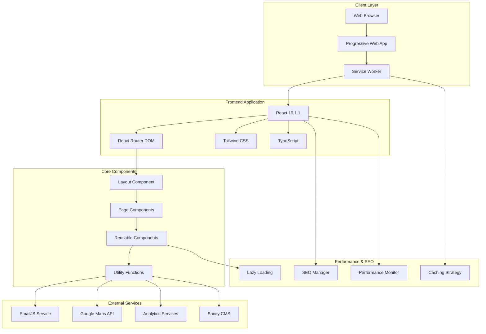
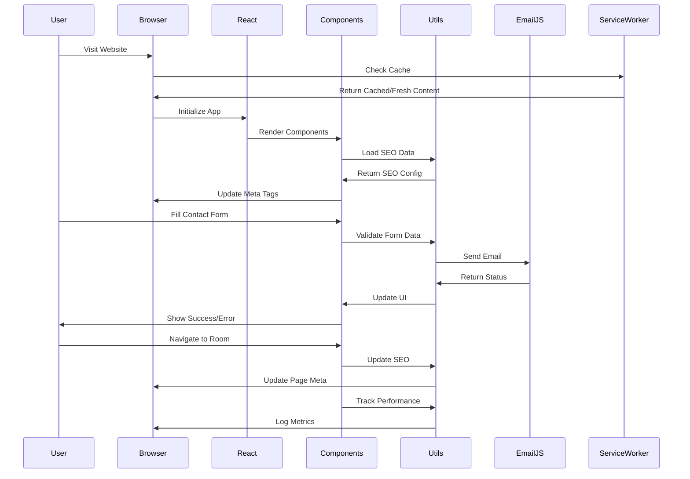
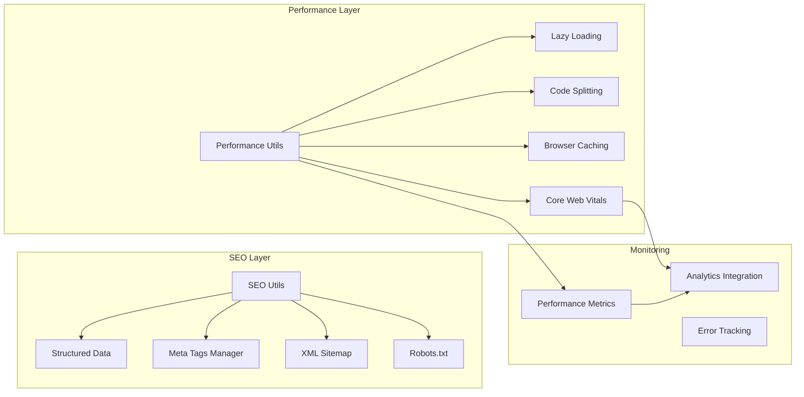
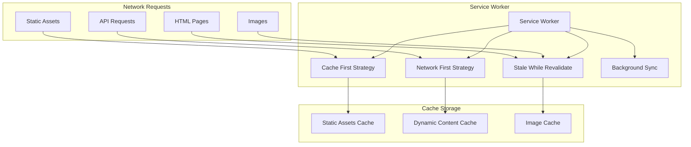
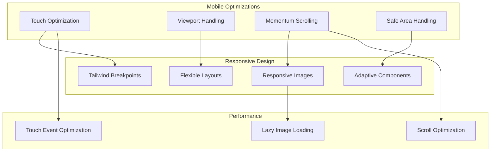
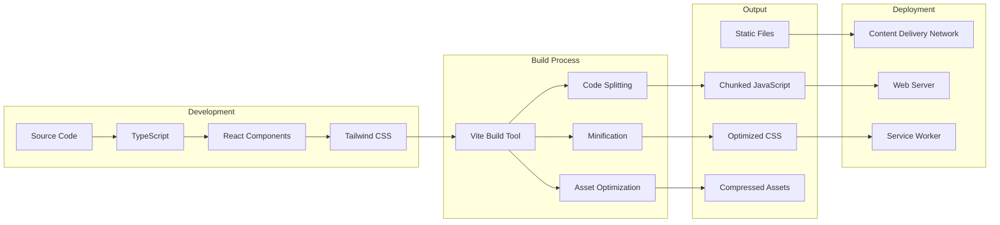

# Deewan Residency - System Architecture

This document provides a comprehensive overview of the Deewan Residency hotel booking website architecture, including component relationships, data flow, and system integrations.

## High-Level System Architecture

## Component Architecture

```mermaid
graph TD
    subgraph "App Component"
        App[App.tsx]
        PerformanceMonitor[Performance Monitor]
        Layout[Layout Component]
    end

    subgraph "Layout Components"
        Header[Header]
        Navigation[Navigation]
        Footer[Footer]
    end

    subgraph "Page Components"
        Home[Home Page]
        Rooms[Rooms Page]
        RoomDetail[Room Detail Page]
        Dining[Dining Page]
        Gallery[Gallery Page]
        About[About Page]
        Contact[Contact Page]
        Privacy[Privacy Policy]
        Terms[Terms of Service]
    end

    subgraph "Shared Components"
        Hero[Hero Component]
        RoomCard[Room Card]
        ContactForm[Contact Form]
        BusinessBookingForm[Business Booking Form]
        DiningReservationForm[Dining Reservation Form]
        InquiryForm[Inquiry Form]
        Map[Map Component]
        LazyImage[Lazy Image Component]
        DiningCard[Dining Card]
        Gallery_Component[Gallery Component]
        CategoryFilter[Category Filter]
        RoomGallery[Room Gallery]
        BusinessFacilityCard[Business Facility Card]
    end

    App --> PerformanceMonitor
    App --> Layout
    Layout --> Header
    Layout --> Navigation
    Layout --> Footer
    
    App --> Home
    App --> Rooms
    App --> RoomDetail
    App --> Amenities
    App --> Dining
    App --> Gallery
    App --> About
    App --> Contact
    
    Home --> Hero
    Rooms --> RoomCard
    RoomDetail --> RoomGallery
    RoomDetail --> InquiryForm
    Amenities --> AmenityCard
    Amenities --> CategoryFilter
    Amenities --> BusinessFacilityCard
    Amenities --> BusinessBookingForm
    Dining --> DiningCard
    Dining --> DiningReservationForm
    Gallery --> Gallery_Component
    Contact --> ContactForm
    Contact --> Map
    
    RoomCard --> LazyImage
    Gallery_Component --> LazyImage
    DiningCard --> LazyImage
    AmenityCard --> LazyImage
```

## Data Flow Architecture

## SEO & Performance Architecture

## Service Worker Architecture

## Mobile Optimization Architecture

## Build & Deployment Architecture

## Technology Stack

### Frontend Framework
- **React 19.1.1** - Modern React with concurrent features
- **TypeScript** - Type-safe development
- **React Router DOM 7.9.5** - Client-side routing

### Styling & UI
- **Tailwind CSS 3.4.18** - Utility-first CSS framework
- **PostCSS** - CSS processing and optimization
- **Custom CSS** - Performance-optimized styles

### Build Tools
- **Vite 7.1.12** - Fast build tool and dev server
- **ESBuild** - Fast JavaScript bundler and minifier
- **Rollup** - Module bundler for production builds

### External Services
- **EmailJS 4.4.1** - Email service integration
- **Google Maps API** - Location and mapping services

### Performance & SEO
- **Service Worker** - Offline support and caching
- **Web Vitals Monitoring** - Performance tracking
- **Schema.org Structured Data** - SEO optimization
- **Lazy Loading** - Image optimization

### Development Tools
- **ESLint** - Code linting and quality
- **Autoprefixer** - CSS vendor prefixing
- **TypeScript Compiler** - Type checking

## Key Features

### Performance Optimizations
- Code splitting with vendor, email, and utils chunks
- Lazy loading for images and components
- Service worker with advanced caching strategies
- Core Web Vitals monitoring
- Resource preloading and prefetching

### SEO Optimizations
- Comprehensive meta tag management
- Schema.org structured data for Hotel and LocalBusiness
- XML sitemap generation
- Open Graph and Twitter Card support
- Dynamic SEO for individual pages

### Mobile Optimizations
- Touch-friendly interface with 44px minimum touch targets
- Momentum scrolling for iOS
- Viewport handling and safe area support
- Responsive design with mobile-first approach

### Accessibility Features
- WCAG 2.1 AA compliance
- Keyboard navigation support
- Screen reader optimization
- High contrast mode support
- Reduced motion preferences

This architecture ensures a scalable, performant, and SEO-optimized hotel booking website that provides an excellent user experience across all devices and platforms.